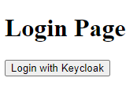
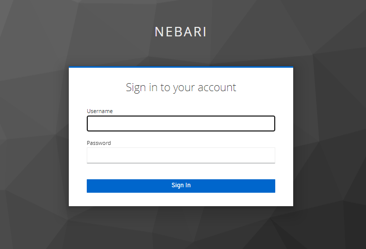
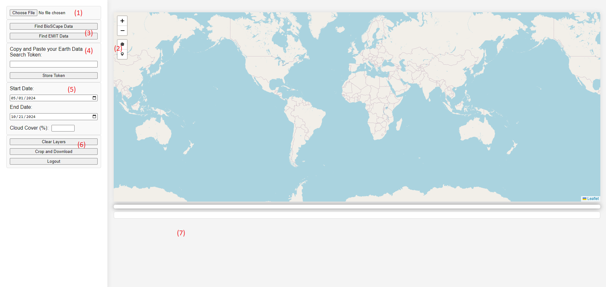
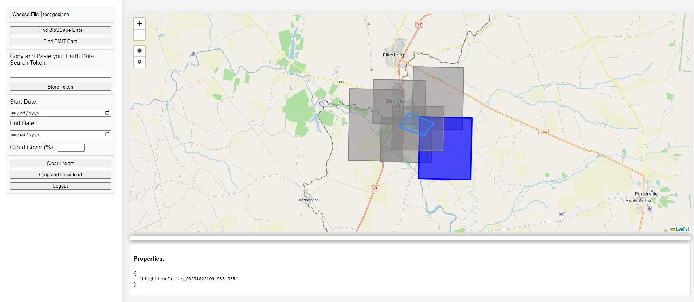
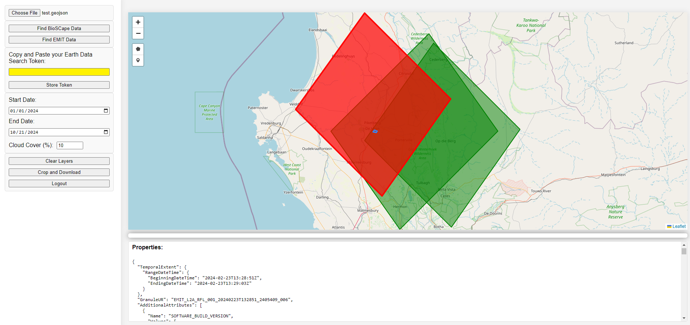

=============================================
BioSCape Cropping Web Application User Guide
=============================================

**This application is in active development. The current user interface is basic and serves as a proof of concept. Please report any issues via GitHub or Slack.**

Access
======
To access the application, go to `crop.bioscape.io <https://crop.bioscape.io>`_. You can log in using your BioSCape SMCE username and password.

.. ---

Overview
=========
The BioSCape Cropping Web Application simplifies the process of finding and retrieving BioSCape and EMIT data. Users can upload and display a GeoJSON or draw polygons directly on the map, find overlapping BioSCape or EMIT reflectance data, and select a file to crop and download.

The application includes the following features:

1. GeoJSON file upload.
2. Polygon or marker drawing tool.
3. Buttons to find EMIT or BioSCape data.
4. Earth Data Login Token interface.
5. Filters **for EMIT data only**.
6. Options to crop and download the selected layer, clear the current map, and log out.
7. Property display for the currently selected image.

.. ---

BioSCape Data
=============
To access BioSCape data:

1. Click on **Find BioSCape Data**. If overlapping data is available, it will be displayed on the map.
2. To crop and download the data, click on the polygon you wish to download, then click the **Crop and Download** button.

.. --- 

EMIT Data
=========
To access EMIT data, an Earth Data Login token is required. Use the following code snippet to retrieve a token:

::

        import earthaccess

        earthaccess.login()

        earthaccess.get_edl_token()

Once you have the token, copy and paste it into the **Earth Data Login Token** text field and click **Store Token**.

Once the token is stored, you can find overlapping EMIT data using the **Find EMIT** button. EMIT data can be filtered by date and cloud cover.

