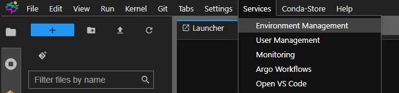
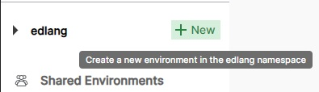
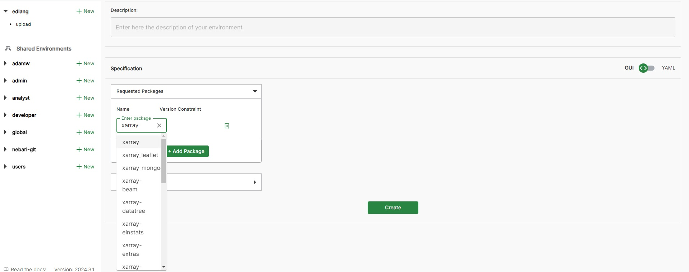
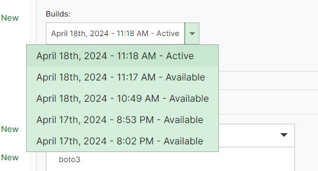

=======================
Juypter Notebook Basics
=======================

Jupyter notebooks provide a literate interactive programming environment where you can mix code, code output (including static and interactive visualizations), and text (formatted as Markdown). There are a large number of tutorials on Jupyter notebooks online; here is `one interactive example`_, and here is the `JupyterLab-specific notebook interface justification`_.

    .. _one interactive example: https://mybinder.org/v2/gh/ipython/ipython-in-depth/HEAD?urlpath=tree/binder/Index.ipynb

    .. _JupyterLab-specific notebook interface justification: https://jupyterlab.readthedocs.io/en/stable/user/notebook.html

Kernels
=======

Jupyter notebooks work by running a specific kernel corresponding to a specific running process of a particular programming language. 

In addition, you can create your own kernels which with new conda environments with specific Python packages.

You can change the kernel of any notebook by clicking the kernel name (default: "Python 3 (ipykernel)") in the top right corner of the notebook interface.

Setting Up a New Kernel
-----------------------
The BioSCape uses Conda Store to manage virutal environments. The Conda Store has dedicated storage for Conda environments. **The dedicated storage is not unlimited so please try not to create duplicate environments.** It is highly recommended to use the Conda Store to create
all virtual environments. If you use the command line the conda environment will be stored in your home directory which has limited space. Once the environment is created
packages can be install via conda install or pip, however these pacakges will not be tracked in by the Conda Store. Only install via the command line as a last resort.

.. _venv:

Creating a New Conda Environment
--------------------------------

* Navigate to the Conda-Store tab or Services -> Environment Management

* Log in to the Conda-Store using your BioSCape SMCE username and password.

* Select new environment

    * If you would like to create an environment for your use only create the environment in your personal namespace. If you would like others
    to have access to the environment select the users namespace.

* Provide a name and a description of your environment and start adding packages clicking add package and searching
    
    * The defualt Python version is 3.12. If you would require a specific version add Python as a package and select the version you would like
    
    * If you have a prefered version of the package use the interface to select the appropriate version
    
    * If you perfer to not use the gui or have yaml file from an existing environment you can click the GUI/YAML slider to switch over 

Editing and Deleting a Conda Environment
----------------------------------------

* Select the environment you would like to edit

* Click edit in the top right corner

* If you would like to delete the environment, select delete environment in the bottom right

* Once you are finished save your changes and the environment will start to build

* **Changes can to an environment can take miniute or two to propogate to a notebook**

Rolling back a Conda Environment
--------------------------------
If you accidently install a package that breaks your environment Conda-Store has an easy to use
role back feature.

* Select edit and use the builds drop down menu to select a previous build

* Save the environment

